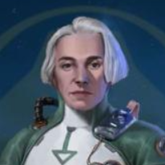
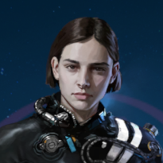
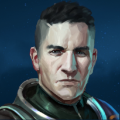

# Named Event Officers

## Ada Hraal

> Former lead scientist of the second expedition to Nimbus. Veteran research
  specialist.

Rarity: **Rare**  
Perk: [Bridge: Research Time](../perks/scientist-perks.md#bridge-research-time)

Ada Hraal was available as part of the "Tanoch Winter Celebrations" event.

## Elise Liirhra

> Elise started out as a beam weapon technician in the Hiigaran fleet, but
  climbed the ranks quickly after implementing Yaot technology into Hiigaran
  weapons. Today she is known as a friend to the Yaot - and an expert in pulsar
  weaponry.

Rarity: **Epic**  
Perk: [Pulsar Burst](../active-abilities.md#pulsar-burst)

Elise Liirhra was available as part of the "Yaot Stories: Astral Conjunctions"
event.

## Hector Soban

> A rising star within the Hiigaran fleet, Hector Soban is leading the cause to
  require fleet gunners to cross train on exotic and foreign weapons systems.

Rarity: **Legendary**

|Perks                               |Level 1|Level 10|Level 20|Level 30|Level 40|
|------------------------------------|-------|--------|--------|--------|--------|
|Sensor: Flagship Targetting Range   |+24%   |+27%    |+30%    |+30%    |+33%    |
|Escort Ship: Escort Targetting Range|+24%   |+24%    |+24%    |+27%    |+27%    |

Hector Soban was available as part of the "Amassari Stories: Rise of the
Kiithless" event.
